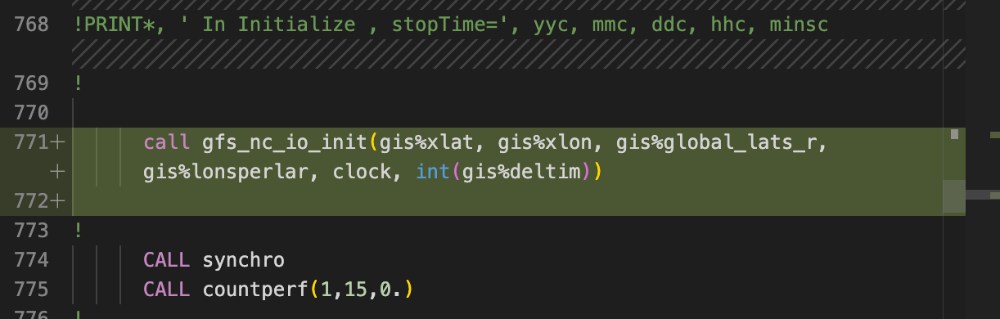
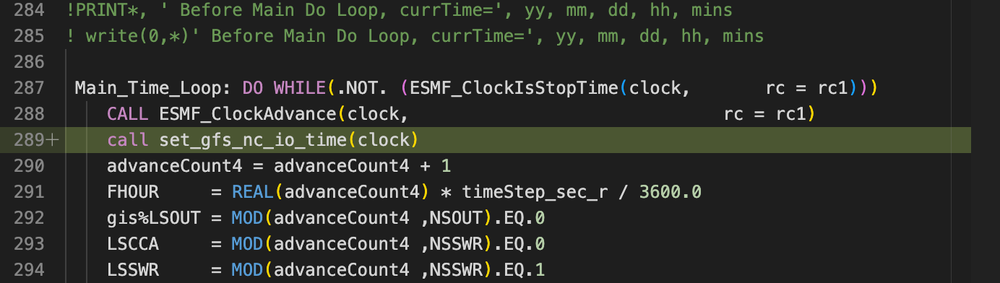
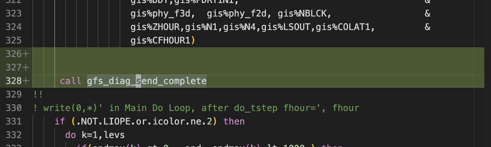
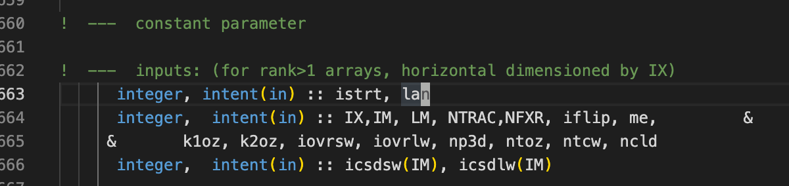

# GFS_NC_IO User Guide

## Introduction
GFS_NC_IO provides a convinient and efficient way to do input and output in netcdf format for GFS model. It uses `data_override` and `diag_manager` from GFDL's Flexible Modelling System (FMS).

## Installation

### FMS (required)
Please refer to <https://github.com/iitm-esm/fms-gfdl> for installing FMS library.

### Installing GFS_NC_IO in CFSv2

- `cd` to source code directory of atm component of CFSv2 (usually it is named as `cfs_atmos_fcst.fd`)

- clone the source code
    ```
    git clone https://github.com/iitm-esm/gfs_nc_io.git 
    ```
- make changes to the **Makefile**. (**Add the lines highlighted in green.**)
  
    
    

- make the following changes to **GFS_Initialize_ESMFMod.f**
    
    

- make the following changes to **GFS_Initialize_ESMFMod.f**
    
    
    
    

- Add `istrt,lan` as input arguments in **gbphys_v.f**
    
    

- Add `istrt,lan` as input arguments in **grrad.f**
    
    

- Modify `call gbphys` in **gbphys_call.f** to include `istrt,lan`
    

- Modify `call grrad` in **gloopr.f** to include `lon,lan`
    

After these changes are made compile the model as usual.

## Usage

### GFS_DATA_OVERRIDE
subroutine `gfs_data_override` from `gfs_nc_io_mod` can be used to read values from external netcdf data.
It can read 0d, 2d (lon,lat), 3d (lon,lat,lev) fields which can vary in time. Data is time interpolated to 
the model time. The external netcdf data should be on a global regular lat/lon grid but can be of any spatial resolution. Data is bilinearly interpolated to the reduced grid of the model.

#### In dotstep_sicdif.f
For e.g. In subroutine `do_tstep` to override a variable `sfc_fld%TSEA` with the data of variable `SST` from file `/home/user/sst_ice_clim.nc` the following needs to be done:

- import the gfs_send_data in do_tstep
    ```
    use gfs_nc_io, only: gfs_send_data
    ```
- call gfs_send_data with the variable which needs to be overriden, along with a `name`
    ```
    call gfs_send_data(sfc_fld%TSEA,name='TSEA')
    ```
- make the following entry to `data_table`
    ```
    "GFS", "TSEA", "SST", "/home/user/sst_ice_clim.nc", .false.,  1.0
    ```

#### Inside phys window (gbphys or grrad)
Data override can be used directly inside gbphys or grrad. for e.g. In subroutine gbphys to override variable `tsea` with the data of variable `SST` from file `INPUT/sst_ice_clim.nc` the following needs to be done:

- import the gfs_send_data in gbphys
    ```
    use gfs_nc_io, only: gfs_send_data
    ```
- call gfs_send_data with the variable which needs to be overriden, along with a `name`
    ```
    call gfs_send_data(tsea,name='TSEA',istrt,ix,lan)
    ```
    here variable `ix` is already available in gbphys, however `istrt` and `lan` needs to be brought in as input arguments into `gbphys` from where it is called i.e. `gbphys_call.f`
- make the following entry to `data_table`
    ```
    "GFS", "TSEA", "SST", "/home/user/sst_ice_clim.nc", .false.,  1.0
    ```


